# 🌟 Hesara Dinal

<div align="center">
  
```ascii
╭─────────────────────────────────────────────────────────────╮
│  ██╗  ██╗███████╗███████╗ █████╗ ██████╗  █████╗           │
│  ██║  ██║██╔════╝██╔════╝██╔══██╗██╔══██╗██╔══██╗          │
│  ███████║█████╗  ███████╗███████║██████╔╝███████║          │
│  ██╔══██║██╔══╝  ╚════██║██╔══██║██╔══██╗██╔══██║          │
│  ██║  ██║███████╗███████║██║  ██║██║  ██║██║  ██║          │
│  ╚═╝  ╚═╝╚══════╝╚══════╝╚═╝  ╚═╝╚═╝  ╚═╝╚═╝  ╚═╝          │
╰─────────────────────────────────────────────────────────────╯
```

**`🚀 Software Architect` • `📱 Mobile Innovator` • `🌐 Full-Stack Visionary`**

[](https://git.io/typing-svg)

</div>

---

## 🎯 **Current Mission**

```typescript
const hesara = {
  role: "Software Architect & Mobile Engineer",
  mission: "Crafting next-generation digital experiences",
  currentFocus: ["Cross-Platform Development", "AI Integration", "Cloud Architecture"],
  motto: "Code with purpose, build with passion 🔥"
}
```

<div align="center">

### 🌐 **Connect With Me**

[](https://linkedin.com/in/hesara-dinal-aa667b354)
[](mailto:dinalhesara6@gmail.com)
[](https://github.com/HesaraDinal1234)

</div>

---

## ⚡ **Tech Arsenal**

<div align="center">

### 🎨 **Frontend Mastery**


### 🛠️ **Languages & Frameworks**


### 🚀 **Tools & Platforms**


</div>

---

## 📊 **Performance Metrics**

<div align="center">


</div>

<div align="center">


</div>

---

## 🏆 **Featured Projects**

<div align="center">

### 📱 **ToDoList - Kotlin Edition**
[](https://github.com/HesaraDinal1234/ToDoList-Kotlin)

</div>

```kotlin
// Current project architecture
class ModernTodoApp {
    val architecture = "MVVM + Clean Architecture"
    val ui = "Jetpack Compose"
    val database = "Room Database"
    val features = listOf(
        "Material You Design",
        "Dark/Light Theme",
        "Offline-First Architecture",
        "Cloud Sync Ready"
    )
}
```

---

## 📈 **Activity Heatmap**

<div align="center">


</div>

---

## 🎯 **What I'm Building**

<table align="center">
<tr>
<td align="center" width="50%">

**🔥 Current Focus**
- Cross-platform mobile apps with Flutter
- Modern Android development with Compose
- Cloud-native architectures
- AI-powered user experiences

</td>
<td align="center" width="50%">

**🌱 Learning Path**
- Advanced React patterns
- Microservices architecture
- Machine Learning integration
- Web3 & Blockchain fundamentals

</td>
</tr>
</table>

---

## 💭 **Philosophy**

<div align="center">

> *"Code is poetry written in logic, and every app is a story waiting to be told."*

```mermaid
graph LR
    A[💡 Idea] --> B[🎨 Design]
    B --> C[⚡ Code]
    C --> D[🚀 Deploy]
    D --> E[📊 Iterate]
    E --> A
```



</div>

---

## 🌟 **Fun Facts**

- 🎮 **Gamer at heart** - Love exploring game development in spare time
- 🌍 **Location**: Kadugannawa, Sri Lanka 🇱🇰
- ☕ **Fuel**: Coffee and clean code
- 🎯 **Goal**: Building apps that make a difference
- 🔭 **Dream**: Contributing to space technology software

---

<div align="center">

### 🚀 **Ready to Collaborate?**

**Let's build something amazing together!**

[](https://github.com/HesaraDinal1234)

---

*Made with ❤️ and lots of ☕ by Hesara Dinal*

</div>
